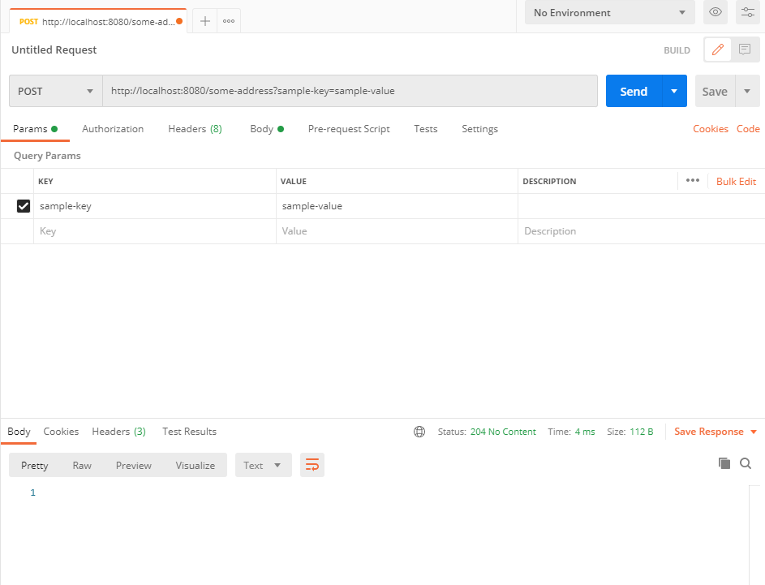
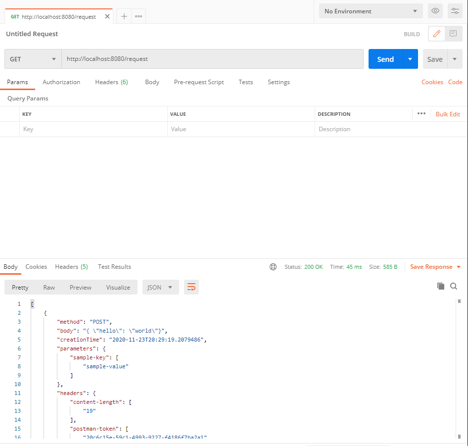

# Webhooks Receiver
Simple server for HTTP webhooks testing purposes. 

### How to use it?
1. Clone repository `git clone https://github.com/wojdzie/webhooks-receiver.git`
2. Go to cloned directory and start application `mvn spring-boot:run`
3. Now you can send any POST request with any path, params, body, headers 
4. Now you can use GET request to recover list of received requests 

### GET /request example
```json
[
    {
        "method": "POST",
        "body": "{ \"hello\": \"world\"}",
        "creationTime": "2020-11-23T20:29:19.2079486",
        "parameters": {
            "sample-key": [
                "sample-value"
            ]
        },
        "headers": {
            "content-length": [
                "19"
            ],
            "postman-token": [
                "20c6c15e-59c1-4993-9227-f4186f7ba2a1"
            ],
            "host": [
                "localhost:8080"
            ],
            "content-type": [
                "application/json"
            ],
            "connection": [
                "keep-alive"
            ],
            "accept-encoding": [
                "gzip, deflate, br"
            ],
            "user-agent": [
                "PostmanRuntime/7.26.8"
            ],
            "accept": [
                "*/*"
            ]
        }
    }
]
```

### Prerequisites
1. [JDK 1.8+](https://adoptopenjdk.net/)
2. [Maven](https://maven.apache.org/download.cgi)